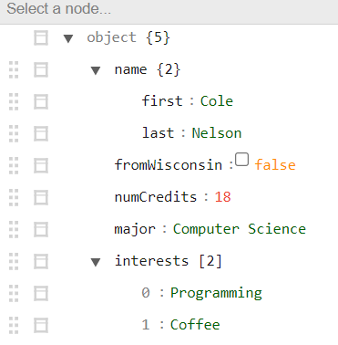

# CS571-F24 HW0: Introductions
In this homework, you will introduce yourself to your classmates using JSON! JSON is short for "JavaScript Object Notation" and it's the primary way that data is communicated over the internet! We will use JSON and its de-serialized counterpart, JS objects, a lot in this class.

## 1. File Creation
Create a file named `me.json` in this directory. Make sure to name it `me.json` and *not* `me.json.txt`.

## 2. About YOU!
In the `me.json` file, you will need to create JSON for an object consisting of...
 - `name`: Your name should be a nested object consisting of...
   - `first`: Your first name as a *string*
   - `last`: Your last name as a *string*
 - `fromWisconsin`: Whether or not you are from Wisconsin as a *boolean*
 - `numCredits`: The number of credits you are taking this semester as a *number*
 - `major`: Your major as a *string*. If you have multiple majors, still use a string, e.g. "Computer Science and Data Science".
 - `interests`: Your interests as an *array* of *strings*. You may have between 0 and 5 interests!

### Special Note

**This information will be used and shared with your classmates in an upcoming assignment.** If you do not feel comfortable sharing this information, *you can make it up!*

Not sure if you did the assignment correctly? Copy and paste your JSON into [jsonparser.org](https://jsonparser.org/). It should look like the following...

### 3. GitHub Classroom
Add, commit, and push your `me.json` file to your GitHub Classroom repository. Copy the commit hash from GitHub and paste it in the Canvas assignment. Congratulations, you have completed your first homework! 🥳