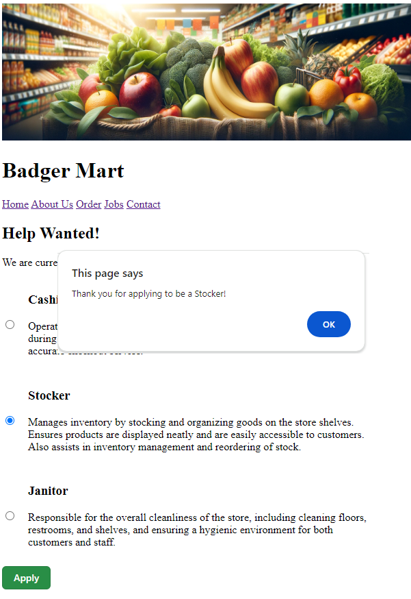

# CS571-F24 HW1: Badger Mart

Welcome to Badger Mart! For this assignment, you will be completing the functionality of the `.html`, `.css`, and `.js` files. You will also be using our first API. 

## JavaScript Essentials

All `.html`, `.css`, and `.js` files are located in the `badger-mart` folder. You can load any of the webpages in a web browser by directly double-clicking on the file. I recommend using [Visual Studio Code](https://code.visualstudio.com/) to do your development work.

**Do not use Live Server for the purposes of this assignment.**

### 0. Featured Item
To get started, let's make sure that you have a working Badger ID! When you open `index.html`, you should see a message that says "Please enter your Badger ID to continue...". **Please enter your Badger ID in the prompt window, press OK, then refresh the webpage.**

If you see today's featured sale at the top of the homepage, you are all good! e.g...

```
Today's sale is Molasses for $3.99, which can only be asked for at the service desk!
```


*Note the special rotates daily, so you may see Sunflower Seeds, Molasses, Tuna, Weetabix, Thyme, Fries (Frozen), or Salmon depending on the day!*

#### Troubleshooting Badger IDs

Not sure what your Badger ID is? Search your email for `CS571 - New Badger ID` sent by `ctnelson2@wisc.edu`.

Never received a Badger ID? [You can self-issue one here.](https://cs571api.cs.wisc.edu/ui/auth) *Please note that it may take **up to a minute** for a new Badger ID to begin working!*

Need to change your Badger ID? There's a cheat code for that! Press `Enter` `Enter` `Up Arrow` `Up Arrow` `Down Arrow` `Down Arrow` within the BadgerMart webpage to delete your Badger ID, then refresh the page. Alternatively, you can delete your session and local storage from your browser settings.

Still have questions? Please search for or make a Piazza post ASAP!


### 1. About Us Page

The `about-us.html` page is currently empty. Make a *plausible-looking* About Us page using text generated from [lorem ipsum](https://www.lipsum.com/) (be sure to cite your source with a comment!). On this page, you should use multiple heading levels, **bold** and *italic* text (remember to use the locale-appropriate tags!), and insert the image from `assets/bagel.png`. The image must be accessible, so be sure to include an `alt` tag describing what it is! There are no other strict requirements for this section, see the screenshot below for an example.


### 2. Button Styling

All of our buttons look the same! However, if you look at the `.html` files, we do distinguish between CSS classes `primary-button` and `secondary-button`. Using `styles.css`, give `primary-button` and `secondary-button` three different CSS attributes (e.g. change the `background-color`, `border`, `padding`, or any other CSS attributes of each). Again, there are no other strict requirements for this section, see the screenshot below for an example.


### 3. Jobs Page

There is a webpage, `jobs.html`, which isn't being shown in our navigation bar. Add a "Jobs" link to each navigation bar in Badger Mart between the "Order" and "Contact" links. You will need to edit all of the other `.html` files in order to do this.

Furthermore, add the `primary` styling to "Apply" button. For now, the button does not need to do anything; we will re-visit this in Step 8.


### 4. Getting State Tax

In `order.js`, implement the function `getSalesTaxRateForState`.

When this function is properly implemented, you can get the sales tax for a state by using the "What is my sales tax rate?" 

**Hint:** Use the `SALES_TAX` object to get the tax rate for a particular state.


### 5. Calculating Subtotal.

In `order.js`, implement the function `calculateSubtotal`.

Use a `for` loop over the `ITEMS` array in combination with `document.getElementById`. You may *not* hardcode the names of the items! Hardcoding will cause you to lose points.

This function should calculate the sum cost of all items ordered. When this function is properly implemented, you can calculate your subtotal using the "Get Subtotal" button in the browser.

For example, ordering two apples, three bagels, and one coconut should cost $5.50.

Assume inputs will always be positive, whole numbers.

**Hint:** You can get the quantity and price of an item by doing...

```js
const quantity = parseInt(document.getElementById("ITEMNAME-quantity").value);
const price = parseFloat(document.getElementById("ITEMNAME-price").innerText);
```


### 6. Calculating Sales Tax

In `order.js`, implement the function `calculateSalesTax`. While it's true that most groceries aren't taxed in the United States, we'll assume that every item is taxable.

You must apply the sales tax rate from `getSalesTaxRateForState` to the amount from `calculateSubtotal`. Use the `roundMoney` function to round to the nearest penny.

When this function is properly implemented, you can calculate your sales tax by using the "Get Sales Tax" button in the browser. 

For example, when ordering two apples, three bagels, and one coconut ($5.50), the Alabama (AL) sales tax should be $0.22 while the Florida (FL) sales tax should be $0.33.


### 7. Completing Order

In `order.js` add an event listener that waits for the "Checkout" button to be pressed. When the checkout button is pressed, alert the user what their total bill is (using `calculateSubtotal` and `calculateSalesTax`).


### 8. Applying for a Job

Finally, in `jobs.js`, implement the function `submitApplication`.

When this function is properly implemented, you should alert the user "Thank you for applying to be a JOB!", where JOB is their selected job (cashier, stocker, or janitor). If no job is selected, you should alert the user "Please select a job!"

**Hint:** You can get the list of radio input elements by using `document.getElementsByName('job')`. Each radio element will have a  `checked` property (whether or not the element is selected) and a `value` property (what the name of the radio button is).

You may *not* hardcode the names of the jobs! Hardcoding will cause you to lose points.



### Done! 🥳
Congrats! Add, commit, and push your files to GitHub Classroom and paste your commit hash in the Canvas assignment.