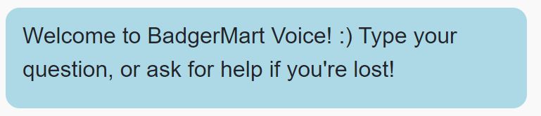
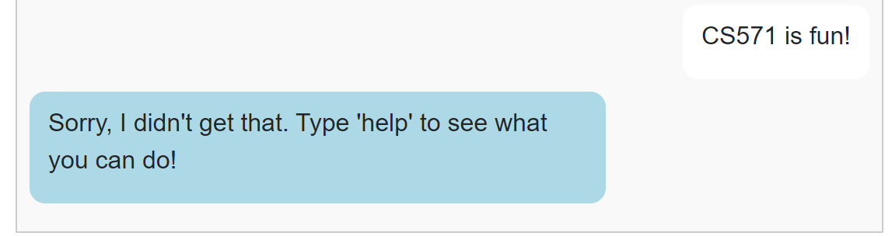
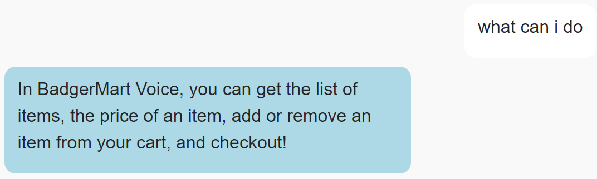
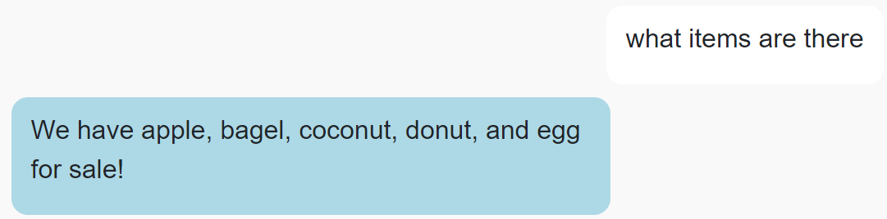
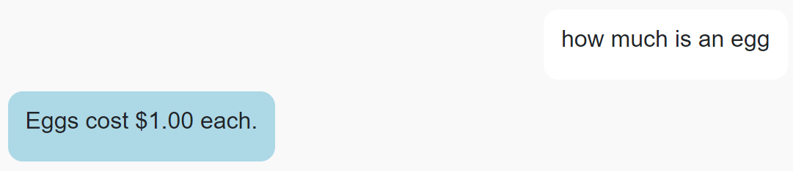
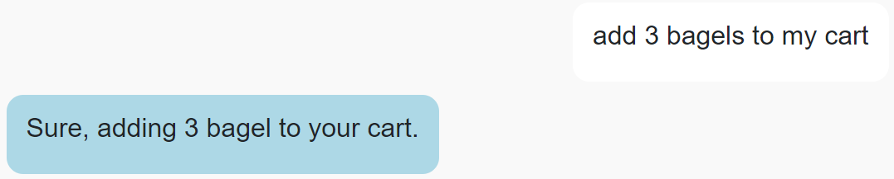
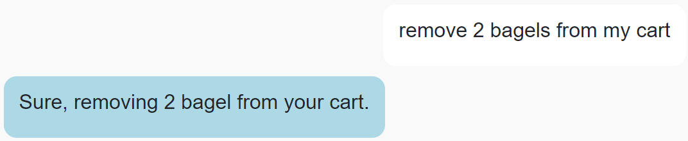
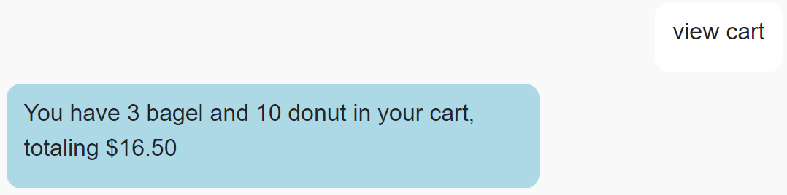
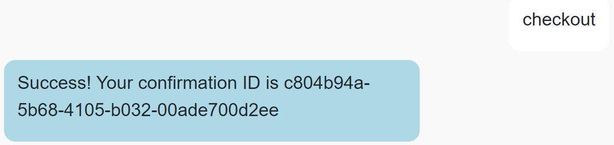

# CS571-F24 HW10: BadgerMart (Chat!)

Welcome back to our final installment of BadgerMart! For this assignment, you will re-implement BadgerMart as *a chat application*. By completing this class, you will have developed a web, mobile, and chat interface for BadgerMart! 🥳🎉 

## Setup

You will complete a [Wit.AI Agent](https://wit.ai/) and some JS handler code as a part of this assignment.

The starter code provided to you was generated using [vite](https://vitejs.dev/guide/). Furthermore, [bootstrap](https://www.npmjs.com/package/bootstrap) and [react-bootstrap](https://www.npmjs.com/package/react-bootstrap) have already been installed. In this directory, simply run...

```bash
npm install
npm run dev
```

Then, in a browser, open `localhost:5173`. You should *not* open index.html in a browser; React works differently than traditional web programming! When you save your changes, they appear in the browser automatically. I recommend using [Visual Studio Code](https://code.visualstudio.com/) to do your development work.

For this assignment, **you will only work on `ChatAgent.js`**. You should **not** change the React JSX components; these have been completed for you! Your focus is to solely write the code in `ChatAgent.js` that interfaces between your [Wit.AI Agent](https://wit.ai/) and the provided React frontend.

## API Notes

All routes are relative to `https://cs571api.cs.wisc.edu/rest/f24/hw10/`

| Method | URL | Purpose | Return Codes |
| --- | --- | --- | --- |
| `GET`| `/items` | Get all items. | 200, 304 |
| `POST` | `/checkout` | Purchases requested items and returns a purchase ID. | 200, 400 |

See `API_DOCUMENTATION.md` for more details.

## Special Requirements
 - *Only* modify your Wit.AI agent and `ChatAgent.js`. Do *not* modify any of the existing `.jsx` components.
 - While you may hardcode item names as an entity of your Wit.AI agent, you may *not* hardcode item names within `ChatAgent.js`.
 - *Each* intent within your Wit.AI agent should be trained on **5+ utterances** 
   - However, you do not need multiple responses for your intents; one response will do.
 - When `fetch`'ing data within `ChatAgent.js`, use the `async`/`await` syntax! Do not use `.then`.
 - When submitting your project, **please be sure to include a .ZIP of your Wit.AI agent!** Further instructions can be found underneath "Submission Details".

## BadgerMart

### 1. Welcome

Within `ChatAgent.js`, implement `handleInitialize` so that your chat agent welcomes the user.

You may also consider initializing `availableItems` to be the data received from `https://cs571api.cs.wisc.edu/rest/f24/hw10/items` at this time. Variables such as `availableItems` are accessible by any function within `createChatAgent`.



### 2. Fallback

Within `ChatAgent.js`, add logic to `handleReceive` such that if the given `prompt` cannot be understood by your Wit.AI agent, it simply tells the user to ask for help.



### 3. Provide Help

In your Wit.AI agent, train your agent to understand a `get_help` intent. Utterances along the lines of "help", "get help", or "what can I do" should trigger this intent.

Then, within `ChatAgent.js`, add logic to `handleReceive` such that if `prompt` matches the `get_help` intent, the agent provides the user with some basic tips such as "try adding or removing items from your basket".



### 4. Get Items

In your Wit.AI agent, train your agent to understand a `get_items` intent. Utterances along the lines of "what can I buy", "what is available", or "what items can I get" should trigger this intent.

Then, within `ChatAgent.js`, add logic to `handleReceive` such that if `prompt` matches the `get_items` intent, the agent provides the user with a list of all the available item names.



### 5. Get Price for Item

In your Wit.AI agent, train your agent to understand a `get_price` intent. Utterances along the lines of "what does an apple cost", "how much is a bagel", or "what's the price of a coconut" should trigger this intent. You only need to support getting the price of one type of item at a time.

Then, within `ChatAgent.js`, add logic to `handleReceive` such that if `prompt` matches the `get_price` intent, the agent provides the user with the price for that item.

If the user fails to mention a particular item, or asks for an item that is not for sale (e.g. "what does a banana cost"), your agent should respond with the item is not in stock.

**Note:** For this intent, you will likely need to create an entity within your Wit.AI agent. You may hardcode item names within the Wit.AI agent, but you may **not** hardcode item names within `ChatAgent.js`.



### 6. Add Item to Cart

In your Wit.AI agent, train your agent to understand an `add_item` intent. Utterances along the lines of "add an apple to my basket", "put 4 donuts in my cart", or "add 7 eggs" should trigger this intent. You only need to support adding one type of item at a time.

Then, within `ChatAgent.js`, add logic to `handleReceive` such that if `prompt` matches the `add_item` intent, the agent adds that item to the user's basket.

If the user fails to mention a particular item, or asks for an item that is not for sale (e.g. "add a banana to my basket"), your agent should respond with the item is not in stock.

If the user fails to mention a quantity, you may assume that the quantity is 1.

If the user requests 0 or less of an item, your agent should inform the user that the quantity is invalid.

If the user provides a non-integer, you may use `Math.floor` to round to an integer.

**Note:** You may find it helpful to create a variable such as `cart` to keep track of the customer's order and initialize this in `handleInitialize`.



### 7. Remove Item from Cart

In your Wit.AI agent, train your agent to understand a `remove_item` intent. Utterances along the lines of "remove an apple from my basket", "delete 4 donuts from my cart", or "remove 7 eggs" should trigger this intent. You only need to support removing one type of item at a time.

Then, within `ChatAgent.js`, add logic to `handleReceive` such that if `prompt` matches the `remove_item` intent, the agent removes that item from the user's basket.

If the user fails to mention a particular item, or asks for an item that is not for sale (e.g. "remove a banana from my basket"), your agent should respond with the item is not in stock.

If the user fails to mention a quantity, you may assume that the quantity is 1.

If the user requests 0 or less of an item, your agent should inform the user that the quantity is invalid.

If the user provides a non-integer, you may use `Math.floor` to round to an integer.

If the user requests to remove more items than they currently have, you should remove all of that item from their basket.



### 8. View Cart

In your Wit.AI agent, train your agent to understand a `view_cart` intent. Utterances along the lines of "view my cart", "what's in my basket", or "what do I have" should trigger this intent.

Then, within `ChatAgent.js`, add logic to `handleReceive` such that if `prompt` matches the `view_cart` intent, the agent lists the items in the cart *as well as* the overall price.

If the user's cart is empty, simply inform them as such.



### 9. Checkout

In your Wit.AI agent, train your agent to understand a `checkout` intent. Utterances along the lines of "checkout", "I'm finished shopping", or "I am done" should trigger this intent.

Then, within `ChatAgent.js`, add logic to `handleReceive` such that if `prompt` matches the `checkout` intent, and the user has items in their cart, the agent should perform a `POST` to `/checkout` and inform the user of their confirmation ID. Upon checkout, the user's cart should be emptied.

If the user's cart is empty, simply inform them as such.

**Note:** Please pay special attention to `API_DOCUMENTATION.md`. In particular, a checkout request will be rejected if...
 - Any item name is ommitted. Item names are case-sensitive and *must* be included even if the quantity is 0.
 - Any quantity is negative or not an integer.
 - No items are ordered (e.g. a *total* quantity of 0).



### Submission Details

**BE SURE TO INCLUDE A COPY OF YOUR WIT.AI AGENT!** You can download this by visiting your `Wit.AI Project > Management > Settings > Export Your Data > Download .zip with your data`. Please commit and push this ZIP file as a part of your Git repository.

In addition to your code, **you will also need to submit a video recording of your app**. Like the demo video, it should cover all the tasks below. Please thoroughly demonstrate all tasks to showcase the capabilities of your app.

**Please embed your recording as a Kaltura video as a part of the assignment submission.** You may find [Zoom](https://support.zoom.us/hc/en-us/articles/201362473-Enabling-and-starting-local-recordings) helpful for recording your screen.

#### Tasks 
 - Show the welcome message
 - Show the fallback message
 - Show the help message
 - Show all of the available items
 - Show the price for 2 items that exist
 - Attempt to show the price of an item that doesn't exist
 - Add an item to your cart
   - View your cart
 - Add multiple of an item to your cart
   - View your cart
 - Attempt to add an item that doesn't exist.
   - View your cart
 - Remove an item from your cart
   - View your cart
 - Attempt to remove more items from your cart than you currently have
   - View your cart
 - Attempt to remove a negative number of items.
   - View your cart
 - Successfully checkout
   - View your cart
 - Attempt to checkout again
