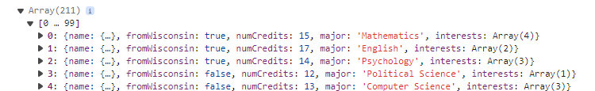
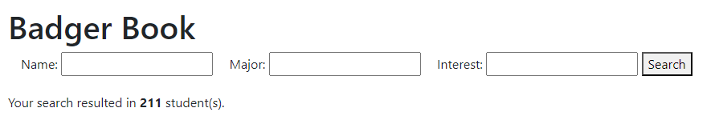
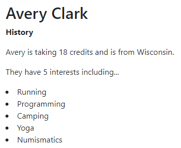
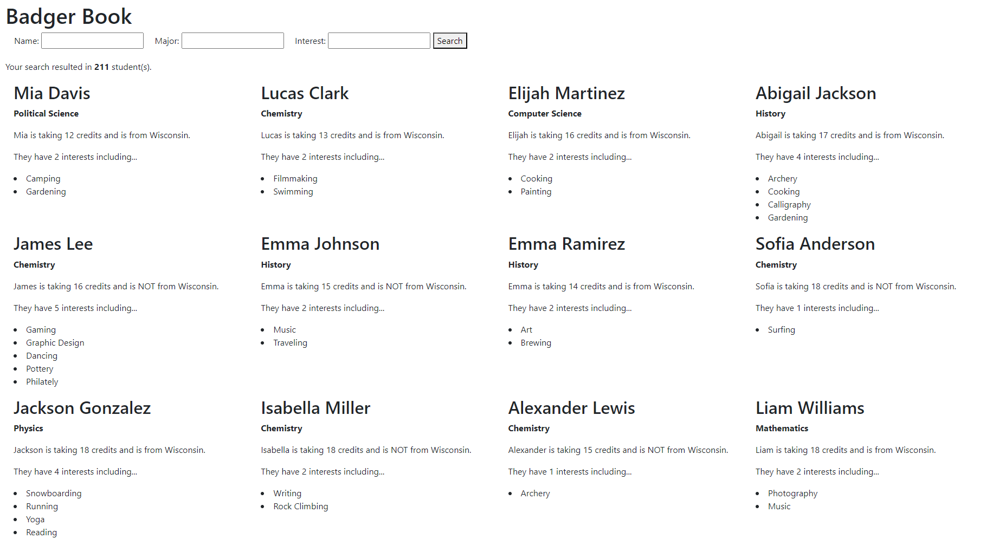
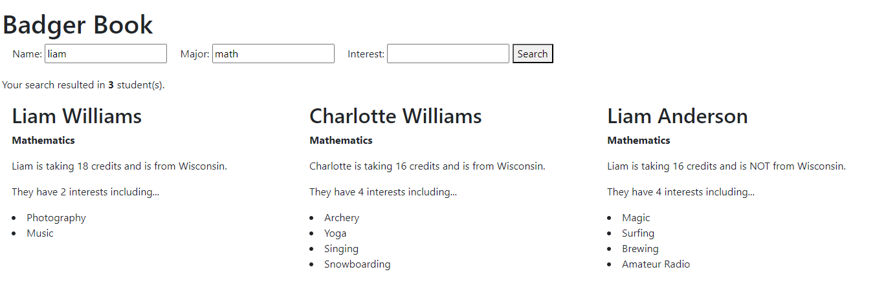
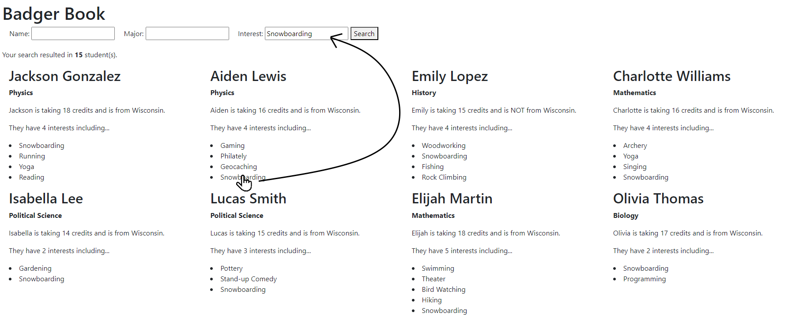

# CS571-F24 HW2: Badger Book

Welcome to Badger Book! In HW0, we collected JSON data about you; in this assignment, you will present this JSON data on a webpage: Badger Book. You'll fetch data from the API, present it on a webpage, and provide search functionality to speed up the introduction process!

## Important
 - For this assignment, you may *only* modify `app.js`. You may *not* modify `index.html`. You will implement the logic in `app.js` to fetch and filter student data to manipulate the DOM of `index.html`.
 - The screenshots below are just an example; the number of students and student data may change as data is refreshed.
 - The order of students is *not* guaranteed. It will occassionally change. This is okay; your solution does *not* need to preserve the order of students.


## Tasks

### 1. Fetching Data

Fetch the student data from `https://cs571api.cs.wisc.edu/rest/f24/hw2/students`. Note that this requires a `X-CS571-ID` header specifying your unique Badger ID. You may either use `CS571.getBadgerId()` (see HW1 for an example) or hardcode your Badger ID. After fetching this data, `console.log` the contents of this array.



### 2. Show # of Students

Use `document` to update the element with id `num-results` to be the number of students in the course. You can use the `innerText` attribute to change the text within `num-results`.



### 3. Displaying Students

Display each student on the webpage. You must use `createElement` and `appendChild` like the in-class exercise; you may **not** use `innerHTML` to insert the student data.

How you choose to display the student data is up to you, but you must display...
 - first & last name
 - major
 - number of credits
 - if they are from WI
 - their interests as an **unordered** (`ul`) list

The students should be displayed on page load.

**Note:** The students may not appear aligned in columns yet; you'll address this in the next step!



### 4. Responsive Design

Use [Bootstrap's grid system](https://getbootstrap.com/docs/4.0/layout/grid/) to make the display *explicitly responsive* so that...
 - 1 column of students is shown on `xs` and `sm` devices
 - 2 columns of students is shown on `md` devices
 - 3 columns of students is shown on `lg` devices
 - 4 columns of students is shown on `xl` or larger devices

You can re-size your browser window to test this.

**Hint:** You can modify each student's [className](https://developer.mozilla.org/en-US/docs/Web/API/Element/className) to give it the responsive `col` classes.



### 5. Search Functionality
Implement search functionality so that a user may search by name, major, and interests when clicking the "search" button. After clicking "search", the only students that should be displayed are those that match the search criteria.

Be sure to put your search logic within `handleSearch`.

 The following are requirements of the search functionality...
 - search terms are case-insensitive, e.g. searching "cat" should yield results with "cAT"
 - search terms are substrings, e.g. "olo" should yield results with "color"
 - search terms are AND expressions, e.g. searching for a name of "Cole", a major of "Computer Science", and an interest of "coffee" should only yield Coles studying computer science who are interested in coffee
 - searching "john", "smith", "john smith", or "ohn smi", should all yield the person named "John Smith"
   - you can achieve this by concatenating each person's first and last name with a space; if the search name is a substring of this concatenation, it is a match
 - if any interest matches the search term, it should be considered a result, e.g. searching "bow" should yield people with interests in "bow hunting", "bowling", or "formal bowing"
 - if a search term is left blank it should not affect the results of the search
 - leading and trailing spaces of search terms should be ignored

Upon searching, `num-results` should be updated to the number of matching students.

Lastly, a user should be able to search many times! For example, if a user searches "Cole" followed by "John", accurate results should be shown for both searches. In order to achieve this, you may use `innerHTML` to *clear* the data; refer to the in-class exercise.

I would *encourage you* but not *require you* to use declarative over imperative programming.



### 6. Similar Interests

When an interest is clicked, the search should be re-ran such that all students with that interest are returned. For example, if John Smith has interests of "Coffee" and "Programming" and a user clicks on the "Coffee" item, the search terms should be updated and *all* students with an interest in coffee (as a substring) are displayed.

Please clear the name and major input fields while doing this similar interest search; anyone with the selected interest (as a substring) should be displayed.

**Hint:** You can add "click" listeners to things other than buttons! For example, when generating the unordered list of interests for each student, you may include code like the following ...

```js
interestItemAnchorHTML.addEventListener("click", (e) => {
    const selectedText = e.target.innerText;
    // TODO update the search terms to search just for the
    //      selected interest, and re-run the search!
})
```



### Done! 🥳

Congrats! Add, commit, and push your files to GitHub Classroom and paste your commit hash in the Canvas assignment.
