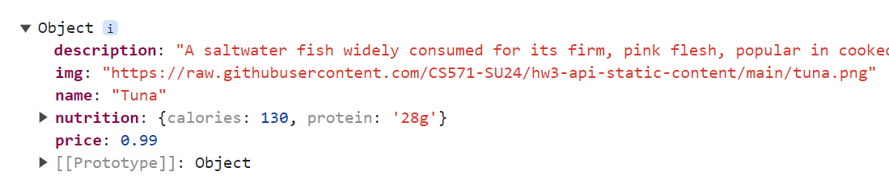
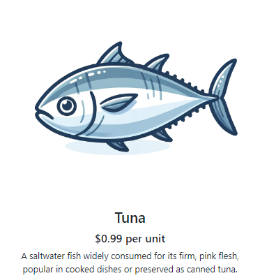
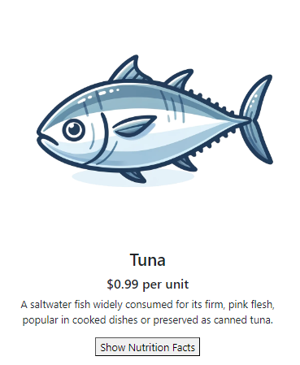
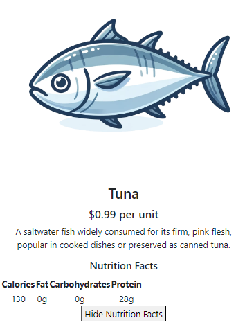
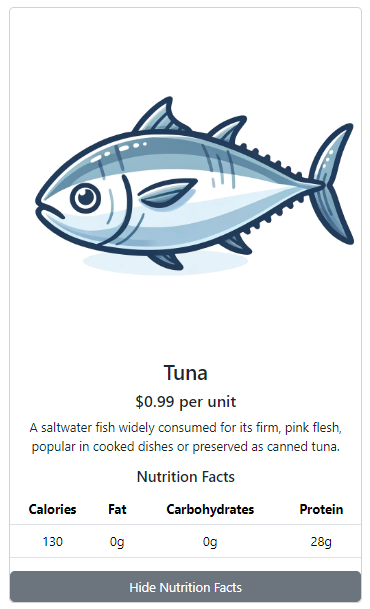

# CS571-F24 HW3: Badger Mart (React!)

Welcome back to Badger Mart! In this homework, you'll create a new version of Badger Mart using React to showcase today's featured item.

## Setup

The starter code provided to you was generated using [vite](https://vitejs.dev/guide/). Furthermore, [bootstrap](https://www.npmjs.com/package/bootstrap) and [react-bootstrap](https://www.npmjs.com/package/react-bootstrap) have already been installed. In this directory, simply run...

```bash
npm install
npm run dev
```

Then, in a browser, open `localhost:5173`. You should *not* open index.html in a browser; React works differently than traditional web programming! When you save your changes, they appear in the browser automatically. I recommend using [Visual Studio Code](https://code.visualstudio.com/) to do your development work.

The two components you will be working with, `BadgerMart.jsx` and `FeaturedItem.jsx`, are located in the `components` folder.

## Debugging

This assignment has you fetching data from `https://cs571api.cs.wisc.edu/rest/f24/hw3/featured-item`, which changes on a daily basis. To see how your code reacts to any given day's feature, you can specify an optional query parameter of 'day', e.g. `https://cs571api.cs.wisc.edu/rest/f24/hw3/featured-item?day=Friday`. This is simply for your testing purposes.

For other debugging tips, please refer to the lecture slides.

## React Fundamentals

### 1. Fetch Featured Item

In `BadgerMart.jsx`, fetch today's featured item from `https://cs571api.cs.wisc.edu/rest/f24/hw3/featured-item` and save it to the `feature` state variable via its mutator function. **As a part of your fetch, `console.log` the response body data that you receive.**



### 2. Display Featured Item

In `FeaturedItem.jsx`, display the item's image, name, price, and description. You may use the name or description of the item as the `alt` tag of the image, but don't forget to specify it! Notice that the data has already been passed to this component from `BadgerMart.jsx`



### 3. Add Button

In `FeaturedItem.jsx`, add a button that says "Show Nutrition Facts". When the button is pressed, it should flip to saying "Hide Nutrition Facts". When the button is pressed again, it should flip back to "Show Nutrition Facts". It should be able to do this toggle indefinitely, e.g. each press of the button should flip what the button says.

**Hint:** You will likely need to add a state variable to track this.



### 4. Show Nutrition Facts

In `FeatureItem.jsx`, add a table of nutrition facts. This table should *only* be displayed while the button reads "Hide Nutrition Facts". When the button reads "Show Nutrition Facts" this table should be hidden.

The table should consist of a single table header of "Calories", "Fat", "Carbohydrates", and "Protein" and a table body of a single row that contains the featured item's macronutrients respectively.

Please note that while each featured item is guaranteed to have a `nutrition` object that contains `calories`, it is not always guaranteed to have an amount of `fat`, `carbohydrates`, or `protein`. You should assume that any missing macronutrients are "0g".

**Side Note:** If you are working on this project on Thursday, know that Thyme is a calorieless food that has no calories or macronutrients. You can try another day using the debugging tips at the start of this README!



### 5. Bootstrapify Featured Item

In `FeaturedItem.jsx`, turn your `div` into a React-Bootstrap `Card` component, turn your `button` into a React-Bootstrap `Button` component, turn your table into a React-Bootstrap `Table` component, and style elements so that they are aesthetically-pleasing. Consider making use of appropriate size and font weight, among other visual design principles, to guide the user's eye through the content of the component.

**Note:** Although we didn't cover React-Bootstrap's table, it is expected for you to read through and utilization [their documentation](https://react-bootstrap.github.io/docs/components/table).

**Hint:** Using a React-Bootstrap table is a simple change, don't overthink it!

There are no strict requirements to this step, other than to use `Card`, `Button`, and `Table` components as well as apply some sort of styling to some component(s).



## Done! 🥳

Congrats! Add, commit, and push your files to GitHub Classroom and paste your commit hash in the Canvas assignment.